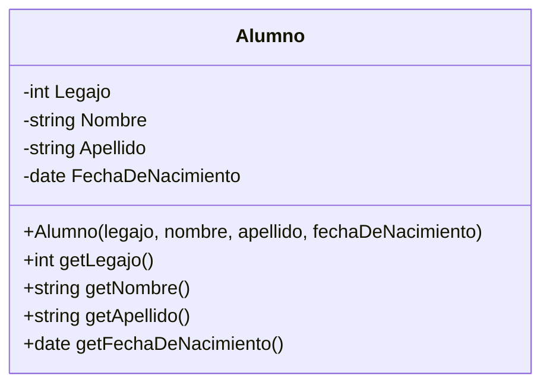
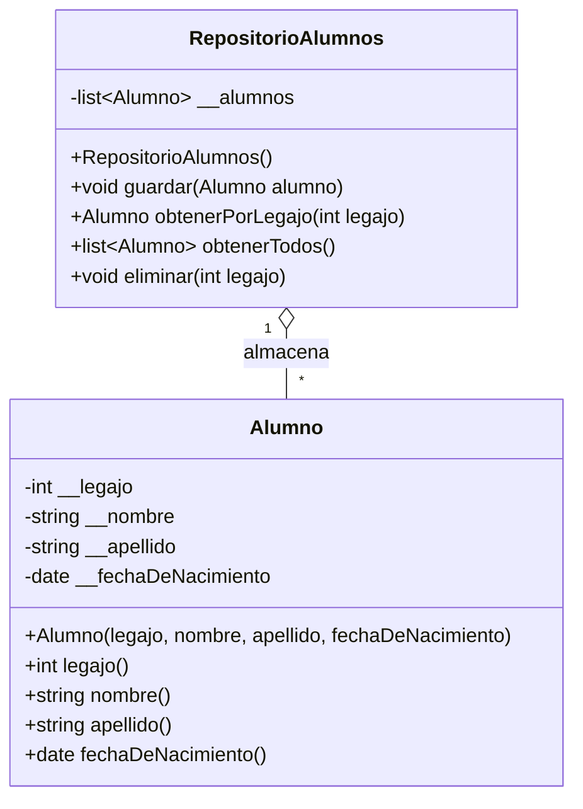

# Clase 16 - 30 de Septiembre del 2026

# Recordatorio

> [!NOTE]
> Luego de la clase si hay dudas o quieren hacer consultas el tiempo de 21:30 - 22:00 el profe esta disponible para consultas ya sea pro discord o por aca.

# Repaso

* Arquitectura en capas
  * Presentacion (API Flask)
  * Modelo
  * Persistencia
* WEB
  * HTTP
    * API Rest
    * Metodo
      * GET
      * PUT
      * POST
      * DELETE
  * DevTools
      * IMPORTANTISIMO (F12)
      * Lo que se para a los amateurs de los DEV
* Python
  * Flask
      * Hicimos el hola mundo
      * Vimos como devolver JSON
  * Serializacion
    * DataClasses
        * Para serializar mas facil y pasar de objetos a JSON
        
---

# Novedades

* Hay un nuevo metodo http que se llama QUERY. Hay que mirarlo un poquito
  * https://dev.to/tykok/the-new-http-method-query-2bec
  * https://www.youtube.com/watch?v=b0oiR_UOvVg

---

# Hoy toca el CRUD con Flask

* Vamos a hacer un CRUD de Alumnos

## Setup

* Creamos un proyecto local

## Modelo

* Por Donde comenzamos? Cual es la parte mas importante de un sistema?
  * Empezamos por el modelo
  * Aplicamos todo lo que vimos en Objeto

 * Mi modelo es la clase Alumno

> [!NOTE]
> Cuando se trabaja con Flask es muy comun utilizar el @dataclass para que se facil de devolver un diccionario

* Primero arranquemos con el UML de la clase Alumno
  * Atributos : Legajo, Nombre, Apellido, FechaDeNacimiento
  * Reglas : Los nombres no tieenen numeros ni espacio, la primer letra en mayuscula y no se puede cambiar una vez creado ningun dato
  


* Vamos a una implementacion en pyton con @Dataclass

```python
from dataclasses import dataclass
from datetime import date


@dataclass(frozen=True)
class Alumno:
    _legajo: int
    _nombre: str
    _apellido: str
    _fecha_de_nacimiento: date

    def __post_init__(self):
        if self._legajo <= 0:
            raise ValueError("El legajo debe ser mayor que 0.")

        self._validar_nombre(self._nombre, "nombre")
        self._validar_nombre(self._apellido, "apellido")

        if self._fecha_de_nacimiento > date.today():
            raise ValueError("La fecha de nacimiento no puede ser futura.")

    @staticmethod
    def _validar_nombre(valor: str, campo: str):
        if not valor:
            raise ValueError(f"El {campo} no puede estar vacío.")

        if not valor.isalpha():
            raise ValueError(
                f"El {campo} no puede contener espacios ni números."
            )

        if not valor[0].isupper():
            raise ValueError(
                f"El {campo} debe comenzar con mayúscula."
            )

    @property
    def legajo(self) -> int:
        return self._legajo

    @property
    def nombre(self) -> str:
        return self._nombre

    @property
    def apellido(self) -> str:
        return self._apellido

    @property
    def fecha_de_nacimiento(self) -> date:
        return self._fecha_de_nacimiento
```

> [!NOTE]
> Si uso @dataclass los atributos se suelen validar en el _post_init__

# Vamos a hacer un repositorio

* Primero el UML


