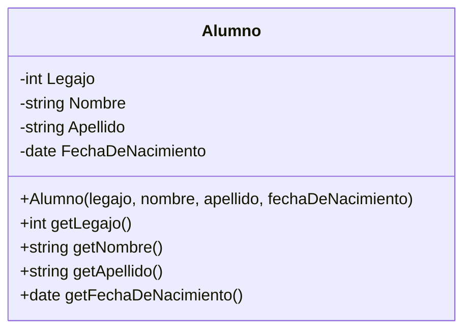
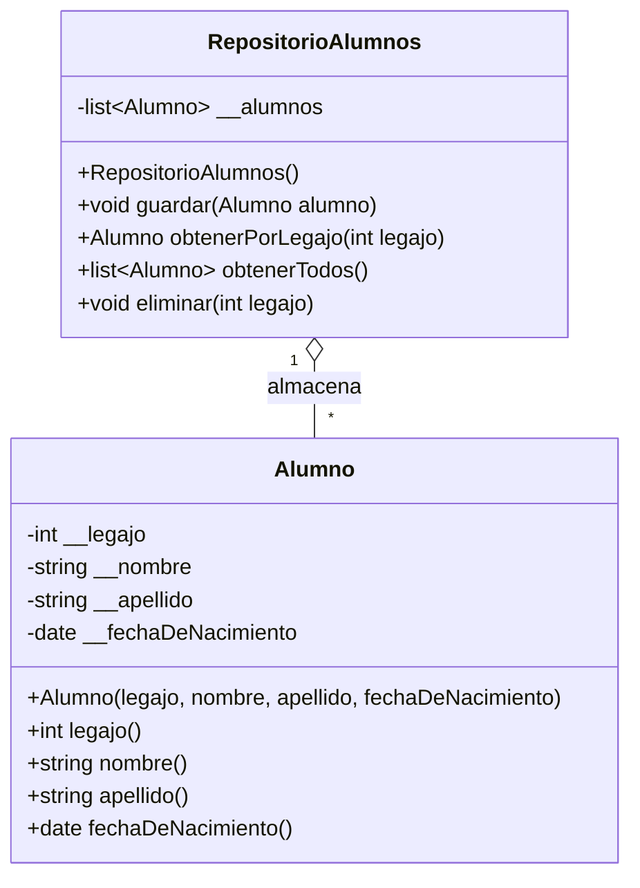

# Clase 16 - 30 de Septiembre del 2026

# Recordatorio

> [!NOTE]
> Luego de la clase si hay dudas o quieren hacer consultas el tiempo de 21:30 - 22:00 el profe esta disponible para consultas ya sea pro discord o por aca.

# Repaso

* Arquitectura en capas
  * Presentacion (API Flask)
  * Modelo
  * Persistencia
* WEB
  * HTTP
    * API Rest
    * Metodo
      * GET
      * PUT
      * POST
      * DELETE
  * DevTools
      * IMPORTANTISIMO (F12)
      * Lo que se para a los amateurs de los DEV
* Python
  * Flask
      * Hicimos el hola mundo
      * Vimos como devolver JSON
  * Serializacion
    * DataClasses
        * Para serializar mas facil y pasar de objetos a JSON
        
---

# Novedades

* Hay un nuevo metodo http que se llama QUERY. Hay que mirarlo un poquito
  * https://dev.to/tykok/the-new-http-method-query-2bec
  * https://www.youtube.com/watch?v=b0oiR_UOvVg

---

# Hoy toca el CRUD con Flask

* Vamos a hacer un CRUD de Alumnos

## Chat De IA del Proyecto

* https://chatgpt.com/share/6abd90b8-f990-83e9-a2cf-2e055f51a240

## Setup

* Creamos un proyecto local
* Vamso a decidir la estructura de carpetas del proyectos
* Hay varios estandares
  * https://github.com/microsoft/cookiecutter-python-flask-clean-architecture
  * https://github.com/luizth/architecture-patterns-with-python

 * Carpetas comunes en muchos proyectoss
   * models
     * a.k.a. (allso known as): model, domain
    * repository
       * a.k.a. (allso known as): persistence, infraestructure

## Documentacion

* Agregamos al proyecto un archivo README.MD donde describimos la estructura del proyecto

```
# Estructura del proyecto

/
   /models
   /repositories
```

> [!NOTE]
> Es muy importante tener este archivo Readme.md para ayudarla a la IA a entender le pryecto


## Modelo

* Por Donde comenzamos? Cual es la parte mas importante de un sistema?
  * Empezamos por el modelo
  * Aplicamos todo lo que vimos en Objeto

 * Mi modelo es la clase Alumno

> [!NOTE]
> Cuando se trabaja con Flask es muy comun utilizar el @dataclass para que se facil de devolver un diccionario

> [!NOTE]
> En la medida de lo posible todo lo que son Reglas de negocio cuanto mas vayan dentro de la capa de modelo, mejor. En este ejemplo la unica regla de negocio que tenemos son las que aseguran la consistencia del alumno

* Primero arranquemos con el UML de la clase Alumno
  * Atributos : Legajo, Nombre, Apellido, FechaDeNacimiento
  * Reglas : Los nombres no tieenen numeros ni espacio, la primer letra en mayuscula y no se puede cambiar una vez creado ningun dato
  


* Vamos a una implementacion en pyton con @Dataclass

```python
from dataclasses import dataclass
from datetime import date


@dataclass(frozen=True)
class Alumno:
    _legajo: int
    _nombre: str
    _apellido: str
    _fecha_de_nacimiento: date

    def __post_init__(self):
        if self._legajo <= 0:
            raise ValueError("El legajo debe ser mayor que 0.")

        self._validar_nombre(self._nombre, "nombre")
        self._validar_nombre(self._apellido, "apellido")

        if self._fecha_de_nacimiento > date.today():
            raise ValueError("La fecha de nacimiento no puede ser futura.")

    @staticmethod
    def _validar_nombre(valor: str, campo: str):
        if not valor:
            raise ValueError(f"El {campo} no puede estar vacío.")

        if not valor.isalpha():
            raise ValueError(
                f"El {campo} no puede contener espacios ni números."
            )

        if not valor[0].isupper():
            raise ValueError(
                f"El {campo} debe comenzar con mayúscula."
            )

    @property
    def legajo(self) -> int:
        return self._legajo

    @property
    def nombre(self) -> str:
        return self._nombre

    @property
    def apellido(self) -> str:
        return self._apellido

    @property
    def fecha_de_nacimiento(self) -> date:
        return self._fecha_de_nacimiento
```

> [!NOTE]
> Si uso @dataclass los atributos se suelen validar en el _post_init__

# Repositorio

* Primero el UML



> [!NOTE]
> El repositorio guardaria los alumnos en una base de datos, en disco, donde sea. Es la capa que conectaria con la BD. Para este ejemplo vamos a hacer que los guarde en memoria.

```python
from datetime import date

from models.alumno import Alumno


class RepositorioAlumnos:

    def __init__(self):
        self.__alumnos: list[Alumno] = []
        self.__cargar_datos_prueba()

    def __cargar_datos_prueba(self):
        self.__alumnos.append(
            Alumno(1, "Juan", "Perez", date(2000, 5, 15))
        )
        self.__alumnos.append(
            Alumno(2, "Maria", "Gomez", date(1999, 8, 22))
        )
        self.__alumnos.append(
            Alumno(3, "Carlos", "Lopez", date(2001, 3, 10))
        )
        self.__alumnos.append(
            Alumno(4, "Ana", "Martinez", date(1998, 11, 5))
        )
        self.__alumnos.append(
            Alumno(5, "Pedro", "Rodriguez", date(2002, 1, 30))
        )

    def guardar(self, alumno: Alumno) -> None:
        self.__alumnos.append(alumno)

    def obtener_por_legajo(self, legajo: int) -> Alumno | None:
        for alumno in self.__alumnos:
            if alumno.legajo == legajo:
                return alumno

        return None

    def obtener_todos(self) -> list[Alumno]:
        return self.__alumnos.copy()

    def eliminar(self, legajo: int) -> bool:
        alumno = self.obtener_por_legajo(legajo)

        if alumno is None:
            return False

        self.__alumnos.remove(alumno)
        return True
```

# Presentacion

```python
from datetime import date

from models.alumno import Alumno


class RepositorioAlumnos:

    def __init__(self):
        self.__alumnos: list[Alumno] = []
        self.__cargar_datos_prueba()

    def __cargar_datos_prueba(self):
        self.__alumnos.append(
            Alumno(1, "Juan", "Perez", date(2000, 5, 15))
        )
        self.__alumnos.append(
            Alumno(2, "Maria", "Gomez", date(1999, 8, 22))
        )
        self.__alumnos.append(
            Alumno(3, "Carlos", "Lopez", date(2001, 3, 10))
        )
        self.__alumnos.append(
            Alumno(4, "Ana", "Martinez", date(1998, 11, 5))
        )
        self.__alumnos.append(
            Alumno(5, "Pedro", "Rodriguez", date(2002, 1, 30))
        )

    def guardar(self, alumno: Alumno) -> None:
        self.__alumnos.append(alumno)

    def obtener_por_legajo(self, legajo: int) -> Alumno | None:
        for alumno in self.__alumnos:
            if alumno.legajo == legajo:
                return alumno

        return None

    def obtener_todos(self) -> list[Alumno]:
        return self.__alumnos.copy()

    def eliminar(self, legajo: int) -> bool:
        alumno = self.obtener_por_legajo(legajo)

        if alumno is None:
            return False

        self.__alumnos.remove(alumno)
        return True
```

## Vamos a probarlo hasta ahora

```
python api.py
```

* Desde el navegador probamos los endpoint

```
http://127.0.0.1:5000/alumnos
```

* Y tambien

```
http://127.0.0.1:5000/alumnos/1
```


## Pendientes a VER

* mmmmmmmmmm... no me gusta como variable global, despues vemos....
```
#NO me gusta nada como variable global, mmmmmmmmm
repositorio = RepositorioAlumnos()
```

---

# DEUDA COGNITIVA

* Que corno es @staticmethod
  * Lo vamos a explicar lo anoto para no olvidarme
  * El tema de los metodos estaicos que no lo vimos, es muy importante dentro de la Poo
 
---
# Break
Hata y 35
---
